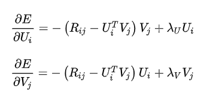
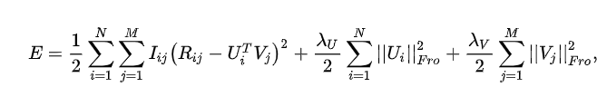
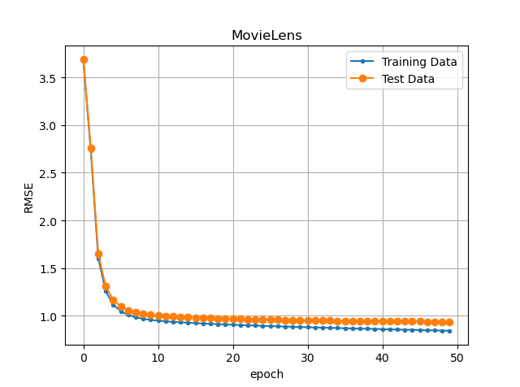
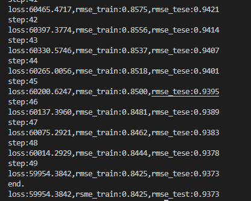
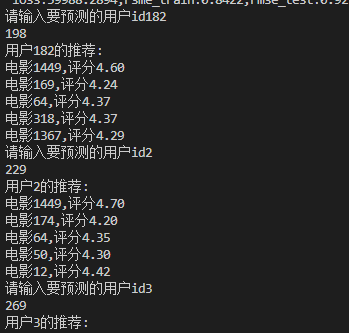

|姓名|学号|
|-|-|
|向正中|2020223040024|

# 第一次作业 PMF
PMF项目复现了论文《Probabilistic Matrix Factorization》

代码参考开源代码

结果：对U、V进行了更新并计算了loss。最后，对指定的用户（user_id）进行了top 5的电影推荐。 

## 论文信息
U,V更新

目标函数

## 参数
|Lambda|D|learning_rate|epoch|
|-|-|-|-|
|0.1|10|0.005|50|

训练集 : 测试集=8:2

## 运行截图
### RSME曲线

### 具体参数

### 推荐结果

