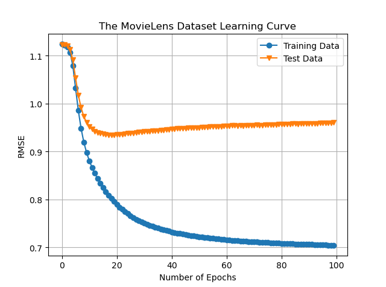
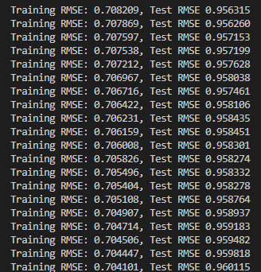

|姓名|学号|
|-|-|
|向正中|2020223040024|

# 第一次作业
代码参考开源代码，修改为了moment梯度下降法
## 参数
|Lambda|feat(D的维度)|epsilon|alpha|moment|epoch|batch|batch_size|
|-|-|-|-|-|-|-|-|
|0.1|10|1|0.1|0.8|100|1000|100|

## 运行截图

