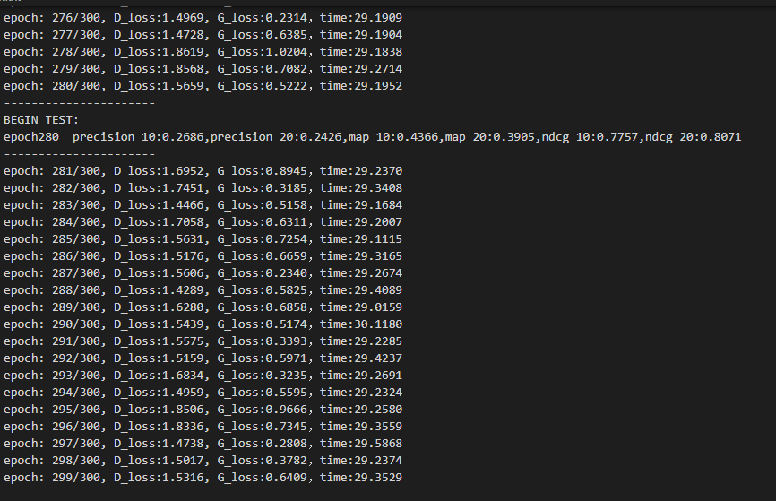
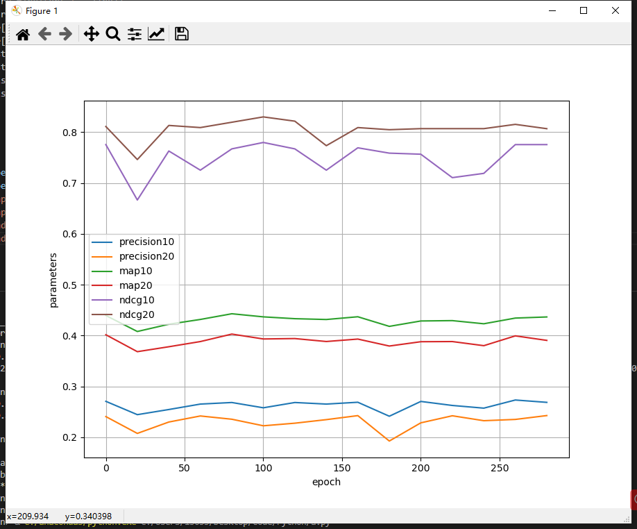
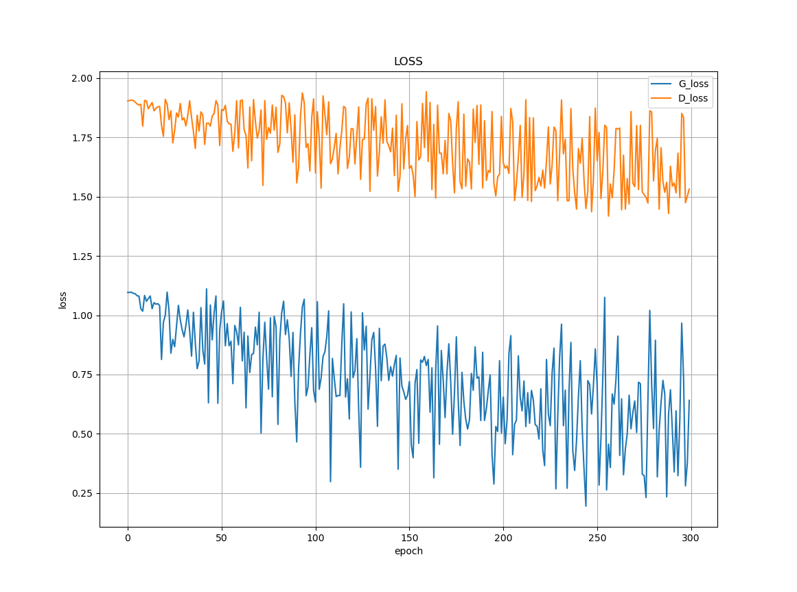

|姓名|学号|
|-|-|
|向正中|2020223040024|

# 第二次作业 PMF
项目复现了论文《LARA Attribute-to-feature Adversarial Learning for New-item Recommendation》

代码参考开源代码,并修改了实现细节

## 参数
|alpha|batch_size|learning_rate|epoch|attr_num|attr_dim|hidden_dim|user_emb_dim|
|-|-|-|-|-|-|-|-|
|0.0001|1024|0.0001|300|18|5|100|18|

训练集 : 测试集=8:2

## 说明
Discrimination.py 和 Generator.py是判别器和生成器

loss.py 和 readtest.py 是生成测试结果的文件

result.txt是运行过程，test.txt是测试结果

evall.py 和 support.py是支持工具，来自开源代码

train.py 是入口文件

## 运行截图
### 运行截图

### ndcg,map,precision for top 10,20

### loss

